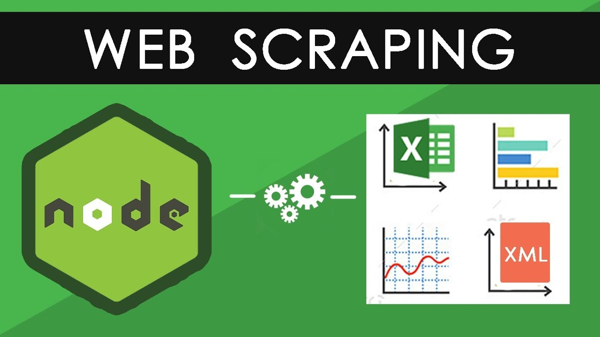
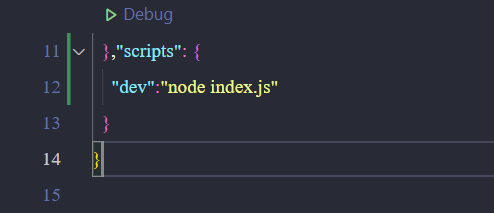
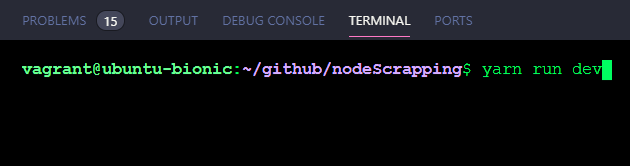
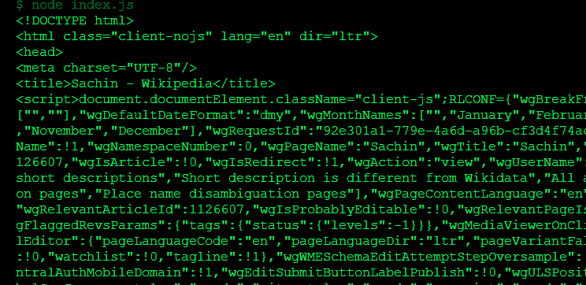

## Web Scrapping com NODE JS & Cheerio 



[ Link do projeto original ](https://medium.com/@nicsachin007/web-scrapping-in-node-js-4a2280063aa3)

## Dependências 
* v15.14.0 - Já instalado em sua máquina
* Editor VS Code

## Pacotes utilizados 
* [ cheerio ](https://www.npmjs.com/package/cheerio)
* [request](https://www.npmjs.com/package/request)

## Como usar ?

Crie uma pasta para iniciar o projeto 

Uma vez dentro da pasta e iniciando seu projeto instale as dependências com o comando

> yarn add cheerio request

Dentro do arquivo index insira o código abaixo

```javascript
var request = require('request');
var cheerio = require('cheerio');

const url ="https://pt.wikipedia.org/wiki/Vegeta"

request(url, function (error, response, html) {
  if (!error && response.statusCode == 200) {
    console.log(html);
  }
});
```
Vá no seu package.json e adicione o campo para iniciar o seu projeto 




Execute com o comando abaixo 




Caso tudo corra bem, essa será a saída no seu terminal 



Mostrando que você conseguiu realizar o scrapping da página!!!

### <<< Para mais usos da ferramenta dê uma olhada na documentação >>> [Cheerion.org ](https://cheerio.js.org)

